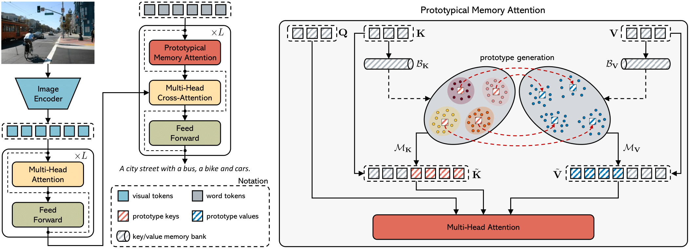

<div align="center">
  <h1>PMA-Net: Prototypical Memory Attention Network<br>(ICCV 2023)</h1>
  
</div>

This repository contains the reference code for the paper [With a Little Help from your own Past: Prototypical Memory Networks for Image Captioning]().

Please cite with the following BibTeX:
```
@inproceedings{sarto2023positive,
  title={{With a Little Help from your own Past: Prototypical Memory Networks for Image Captioning}},
  author={Barraco, Manuele and Sarto, Sara and Cornia, Marcella and Baraldi, Lorenzo and Cucchiara, Rita},
  booktitle={Proceedings of the IEEE/CVF International Conference on Computer Vision},
  year={2023}
}
```
<p align="center">
  
</p> 

## TODO
Source code and trained models will be released soon.
